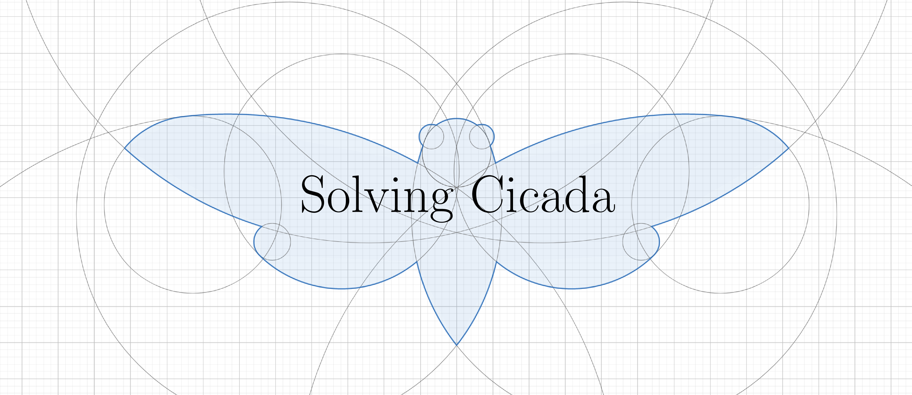

  

## Attempts
For each solving attempt, several elements are given: a title summarizing its conclusion, solvers to contact if more detailed are needed, a link to a more thorough description of the analyses done.
While the summary are quite affirmative, they should not be taken as absolute truth. They are aimed at giving the consensus among solvers regarding the conclusion of the solving attempt.

Unless stated otherwise, contacts given are Discord handles, which they explicitely agreed to being listed there. As ideas often are not original and thus there is no guarantee that solvers credited were the first one to try what they are credited for. More generally, you can always contact `tweqx` to ask about a solving attempt (as she verifies every solving attempt listed here).

There is a huge sampling biais in the way solving attempts are added to this list. Thus, this repository is not be used as exhaustive list of everything that has been tried or as an way to list the most productive solvers (which would anyway be stupid to do).

Contributions are welcome, either by openning [an issue](https://github.com/tweqx/solving_cicada/issues) or by asking nicely to `tweqx` on Discord.

### Cicada OS
* [`560.13` is not an OpenPGP Secret Key](./cicadaos/560.13_not_openpgp_secret_key/README.md)
  
  `file` reports `560.13` as being an "OpenPGP Secret Key". This is a false positive.
* [`560.13` cannot be discriminated as non-random by the Dieharder test suite](./cicadaos/560.13_dieharder/README.md)

  Running the RNG test suite "Dieharder" on `560.13` results in several tests failing, which should indicate that the file content is not random data. It was shown that `560.13` is not long enough and the data reuse strategy used by Dieharder to compensate results in the test failures being not significant.

### The Deep Web Hash
* [The DWH is not the hash of a v3 .onion](./dwh/not_a_v3_onion_hash/README.md) *TODO*

  As v2 .onions are nowadays deprecated and cannot be accessed anymore, a natural question is whether 3301 could have planned to create a v3 .onion, precomputing its address in 2014 and hashing it to produce the DWH. Due to the v3 protocol not existing back in 2014, this is not possible.
* [The DWH is a 512 bit hash](./dwh/512_bit_hash/README.md) *TODO*

  In the Liber Primus, the DWH was given as an hexadecimal string on 4 lines. This does not mean that we should interpret it as 4 separate hashes.
* [Has the DWH been bruteforced?](./dwh/bruteforce_attempts/README.md) *TODO*

  Simply bruteforcing all inputs to find the DWH is not feasible. However, several attempts have been made to bruteforce very specific patterns, such hashing all `pastebin.com/XXXXXX` URLs.
* [The DWH is most likely the ouput of one of these algorithms](./dwh/possible_hashing_algorithms/README.md) *TODO*

  What hashing algorithm could have possibly been used by 3301 to use the DWH? A list of very likely candidates was compiled.
* [The DWH could be the file identifier on a distributed peer-to-peer network](./dwh/as_a_file_identifier/README.md) *TODO*
  
  The hash of a file is often used as a file identifier on distributed, peer-to-peer filesystems. While this is a possibility, systems that use 512 bits hashes aren't very common and we have yet to find a match for the DWH of one of these.
